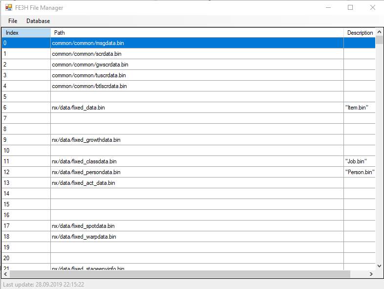

# FE3H File Manager
Creates a named database file structure.

## Use
* Open DATA0.bin file (The DATA1.bin file must be in the same directory);
* Select dist directory;
* Update database, if need;
* Double click on the row to create the file structure.
* Click "Batch->All" to create the structure of all available files.

Database url: https://docs.google.com/spreadsheets/d/18bCCrsHwyAU-JSlpvaulVos3j8dtPBr0mDB-vLWib54

